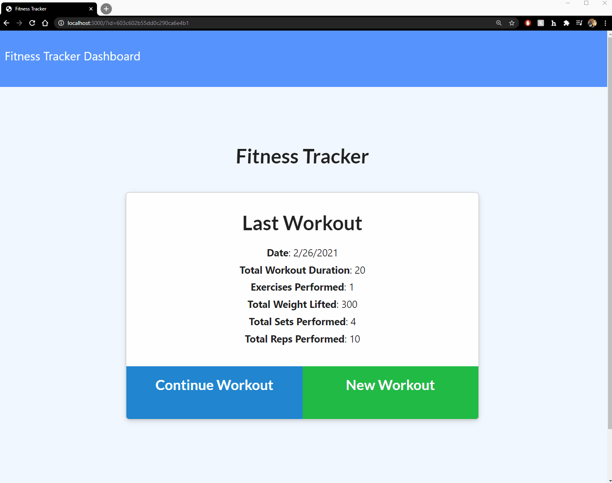

# fitnessMaintained
Application to track one's fitness workouts. 

## Description 
Develop a fitness tracking app utilizing Node.js, Express.js, MongoDB, Heroku and Mongoose. Front end code was provided via prompt and tasks were to set up Models, API and HTML routes. Every workout is able to load a custom list of exercises. All data is maintained in a NOSQL Mongo Database via Heroku and Mongo ATLAS.

## Deployed Live Website: 
https://fitnessapphw.herokuapp.com/

## GIF
Application in action (local):

## Installation 
Run `node install` to install all necessary node modules prior to running application. Application runs natively on port 3000 via localhost. Refer to config folder to change any values in the `config.json`. Refer to `package.json` for scripts to run the application's `server.js` file. I would recommend running `npm run seed` prior to utilizing `npm run watch` or `npm run start` to seed data into local db and open application for full display of graphs etc. 

## Usage 
Creation / Usage of this application was for practice utilizing a NOSQL MongoDatabase and write script for an application to interact. 

## Credits 
Triology Education Services provided prompt, course & instruction. 

## License
[MIT](https://choosealicense.com/licenses/mit/)
